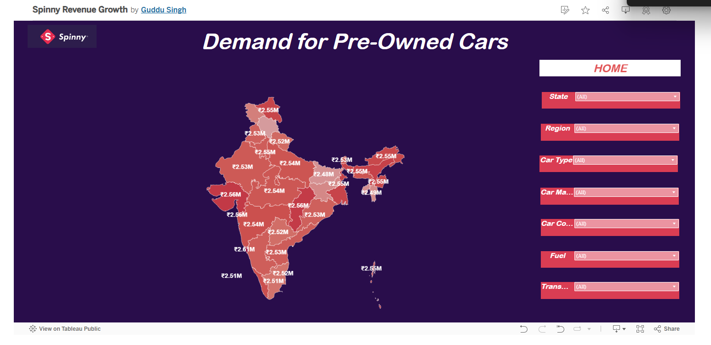

---

## 📊 Tableau Dashboard

▶️ [View Full Interactive Dashboard on Tableau Public](https://public.tableau.com/app/profile/guddu.singh8325/vizzes)

---

### 1️⃣ Home View  
Navigation panel showing 3 dashboards: Demand, Top Cars, Revenue

---

### 2️⃣ Demand for Pre-Owned Cars  
State-wise average pricing and conversion heatmap  
Filters for state, brand, fuel, condition, transmission, etc.

---

### 3️⃣ Most Demanding Cars  
Top models with highest conversion rates and price trends  
Mileage analysis and fuel preference (Gas dominates with 94%+ share)

---

### 4️⃣ Revenue Trends  
Revenue patterns by transmission type and car age  
Insights into price band trends over time

